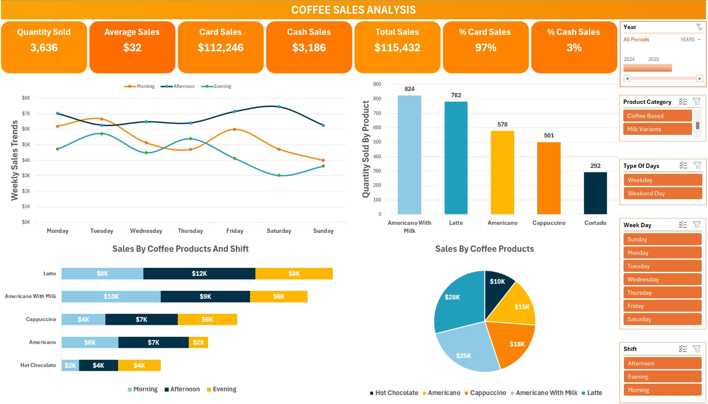
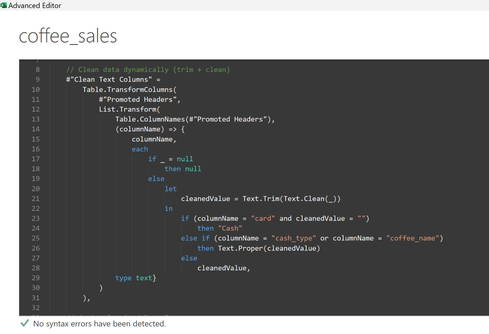
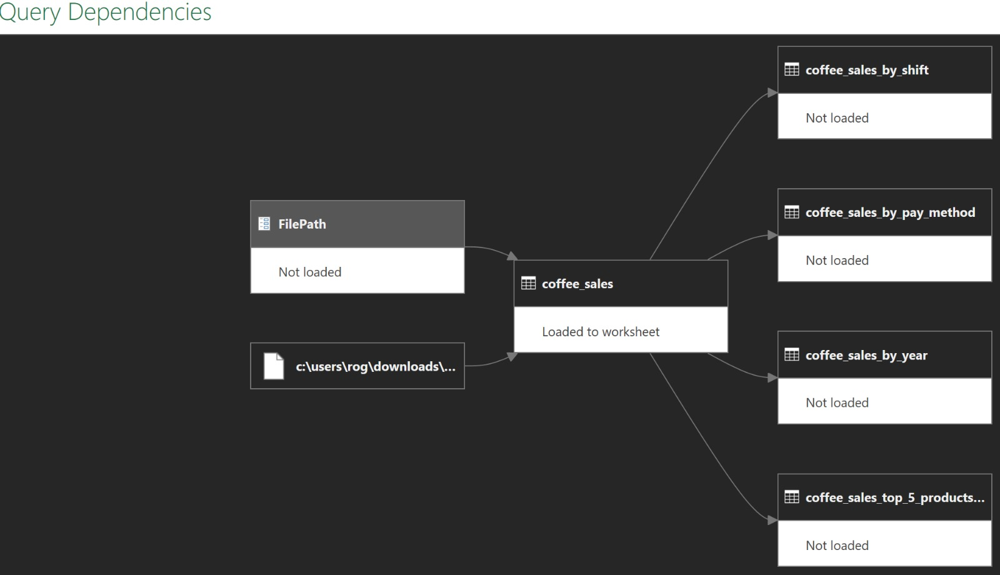

# Power Query (M) Data Cleaning Pipeline

## Complete Technical Documentation



# 1. Introduction

This document explains the complete Power Query ETL pipeline developed
to transform a raw coffee sales CSV file into a clean, structured
dataset ready for analysis.



The pipeline follows the ETL philosophy:

- Extract
- Transform
- Load

The transformations are organized in a logical order to improve data quality, maintainability, and performance while ensuring the resulting dataset can be used confidently for dashboards, PivotTables, and business reporting.

Although the source data is relatively small, the solution is written
using reusable and maintainable Power Query techniques that scale well
to larger projects.

---

# 2. Pipeline Overview

```text
CSV File
   ↓
Promote Headers
   ↓
Clean Text
   ↓
Assign Date Types
   ↓
Create Business Dimensions
   ↓
Assign Remaining Data Types
   ↓
Rename Columns
   ↓
Reorder Columns
   ↓
Final Dataset
```

---

# 3. Source



The query begins with:

```m
Source =
    Csv.Document(
        File.Contents(FilePath),
        [
            Delimiter=",",
            Columns=6,
            Encoding=1252,
            QuoteStyle=QuoteStyle.None
        ]
    )
```

## Purpose

Reads the CSV file into Power Query.

### Why use a parameter?

Using `FilePath` instead of a hard-coded path makes the query portable.
Anyone can reuse the solution by changing the parameter without
modifying the M code.

---

# 4. Promote Headers

The first row is converted into column names.

Without this step, columns would be named Column1, Column2, etc.

---

# 5. Dynamic Text Cleaning

This is the core cleaning step.

Instead of manually cleaning every column, the query dynamically builds
transformation rules.

It combines:

- Table.ColumnNames()
- List.Transform()
- Table.TransformColumns()

This means that every existing text column is processed automatically.

## Cleaning operations

Every value goes through the following process:

1.  Preserve null values.
2.  Remove hidden characters using Text.Clean().
3.  Remove leading/trailing spaces using Text.Trim().
4.  Store the result in cleanedValue.
5.  Apply business-specific rules.

### Why use let?

The expression

```m
let
    cleanedValue = Text.Trim(Text.Clean(_))
```

prevents Power Query from computing the same expression multiple times.

This improves readability and avoids duplicate work.

### Business rules

- Blank values in card become Cash.
- cash_type and coffee_name are converted to Proper Case.
- Remaining columns receive only trimming and cleaning.

---

# 6. Date Types

Date calculations require proper data types.

Functions like Date.Year(), MonthName() and Time.Hour() only work
correctly on Date or DateTime values.

Therefore the query converts these columns before performing business
transformations.

---

# 7. Business Transformations

Instead of creating multiple Add Column steps, the query creates a
single record called TemporalRecord.

That record is expanded into several columns.

Benefits:

- Fewer applied steps.
- Related calculations remain together.
- Easier maintenance.

## Coffee Product Category

Products are grouped into three business categories.

Milk Variants

Chocolate Based

Coffee Based

Text.Contains() is used with Comparer.OrdinalIgnoreCase to make the
comparison insensitive to capitalization.

## Year

Obtained from

Date.Year(\[date\])

## Month

Obtained from

Date.MonthName(\[date\])

## Number of Products

Each transaction represents one purchased product.

Instead of counting rows later, a constant value of 1 is added.

This allows simple SUM aggregations.

## Shift

Business rule:

Morning

Afternoon

Evening

The hour is extracted from the datetime column.

## Type of Day

Saturday and Sunday become Weekend Day.

Every other day becomes Weekday.

---

# 8. Final Data Types

Once all calculated columns exist, remaining data types are assigned.

Examples:

Currency

Whole Number

Text

Explicit types improve reliability and analytical accuracy.

---

# 9. Rename Columns

Technical names become business-friendly names.

money → amount

cash_type → payment_method

card → payment_method_id

These names are easier to understand in dashboards.

---

# 10. Reorder Columns

The final dataset is organized according to analytical needs rather than
the original CSV structure.

Related columns are grouped together.

---

# 11. Why this design?

This pipeline intentionally separates:

Cleaning

Typing

Business logic

Presentation

Each stage has a single responsibility.

This makes debugging significantly easier.

---

# 12. Best Practices Demonstrated

- Parameterized file path
- Dynamic column transformations
- Minimal duplicated calculations
- Explicit data types
- Business-friendly naming
- Record expansion
- Readable step names
- Maintainable ETL flow

---

# 13. Possible Future Improvements

For larger production projects consider:

- Lookup tables instead of nested if statements
- Custom reusable M functions
- try ... otherwise error handling
- Data validation rules
- Logging unexpected values
- Locale-independent weekday calculations
- External configuration tables

---

# 14. Conclusion

The objective of this pipeline is not only to clean data but also to
produce a reusable, readable, and maintainable Power Query solution.

The code follows a logical ETL workflow while minimizing duplicated
calculations and keeping business rules centralized.

Although designed for a coffee sales dataset, the same design principles
can be applied to many real-world Power Query projects.
